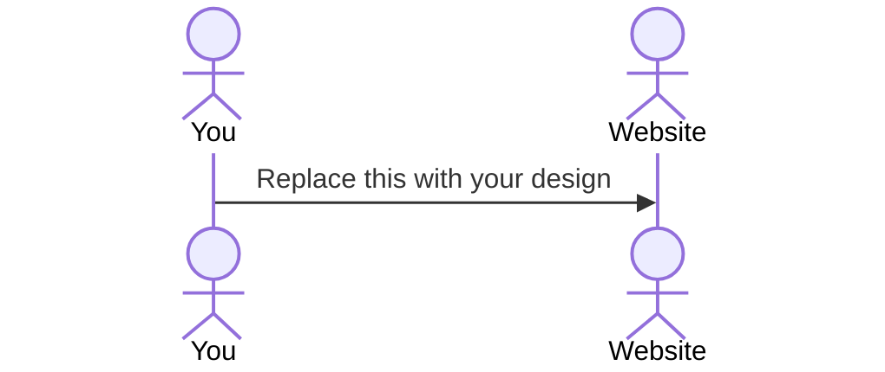

# Drawdle

[My Notes](notes.md)

This a daily drawing game. Every day, you get a new prompt, and then are given a short amount of time to draw it using limited tools. The goal is to get your creativity flowing quickly, and to not get to in your head about the quality of the picture. When the 90 seconds are up, you can then publish your picture, or see other people's pictures given the same theme.

The IP Address is 3.221.164.108

## 🚀 Specification Deliverable

> [!NOTE]
> Fill in this sections as the submission artifact for this deliverable. You can refer to this [example](https://github.com/webprogramming260/startup-example/blob/main/README.md) for inspiration.

For this deliverable I did the following. I checked the box `[x]` and added a description for things I completed.

- [x] Proper use of Markdown
- [x] A concise and compelling elevator pitch
- [x] Description of key features
- [x] Description of how you will use each technology
- [x] One or more rough sketches of your application. Images must be embedded in this file using Markdown image references.

### Elevator pitch

The best way to start your day is with a little bit of creativity. With Drawdle, every day you get a new prompt and are challenged to draw it in 90 seconds. It's fast paced to encourage you to not stress over minor mistakes, while still pushing you to explore your creativity and get better at art. You can then share those designs with your friends and look at others interpretation of the prompt.
### Design

I contacted a TA who said that it was not required.

### Key features

- Drawing functionality
- Ability to change color and brush size
- Secure Log In
- Registration
- Timer functionality, automatically ends when time is reached.
- Ability to share picture via web server
- Vote on other users images, and see other people's votes in real time.
- Pictures are persistently stored.
- No longer supporting drawing with friends.

### Technologies

I am going to use the required technologies in the following ways.

- **HTML** - Uses HTML to create pages for Introduction and Log In, Drawing, and Sharing.
- **CSS** - Styling to work with both PC and phone usage and a simple design to let user pictures pop.
- **React** - Provides Log In, Drawing Functionality, Timer, Changing Color and Brush Size, and displaying other user pictures. Single page for more active design.
- **Service** - Backend endpoints for:
    * User Authentication. User log in, log out and register, with all credentials being safely stored in server.
    * Uploading picture to Server
    * Displaying other stored images.
    * Updating the prompt for each day.
- **DB/Login** - Stores user authentication, as well as pictures for each topic. Also stores rating scores for each picture.
- **WebSocket** - Changed: Now shows when other users finish the Drawdle for the day.

## 🚀 AWS deliverable

For this deliverable I did the following. I checked the box `[x]` and added a description for things I completed.

- [x] **Server deployed and accessible with custom domain name** - [My server link](https://yourdomainnamehere.click).

## 🚀 HTML deliverable

For this deliverable I did the following. I checked the box `[x]` and added a description for things I completed.

- [x] **HTML pages** - I created multiple pages, one for the home page, one for a gallery, one for websocket playing with friends, and one for playing the game.
- [x] **Proper HTML element usage** - I had a mix of HTML elements, including a header with a nav, a main page, and a footer for my github link
- [x] **Links** - I had links inside my navigation, as well as at the bottom of most of the pages for github.
- [x] **Text** - I had text appropriate for each webpage, reflecting how they should look in the future.
- [x] **3rd party API placeholder** - The prompts for each drawdle will be called with a third party API.
- [x] **Images** - I have placeholder images, which will be replaced with images from the server.
- [x] **Login placeholder** - I have a placeholder log in system, including messages for certain applications to require log in, along with log-in pages for all pages except for the main game.
- [x] **DB data placeholder** - I have placeholder data in the images represented in the gallery, and images from other users.
- [x] **WebSocket placeholder** - I have placeholder elements for when websocket functionality comes online.

## 🚀 CSS deliverable

For this deliverable I did the following. I checked the box `[x]` and added a description for things I completed.

- [x] **Visually appealing colors and layout. No overflowing elements.** - I added a simple color scheme to my website, and positioned elements in an appealing way. There are no overflowing elements
- [x] **Use of a CSS framework** - I used bootstrap for my button and modal designs.
- [x] **All visual elements styled using CSS** - All elements have been styled with CSS. The header, footer, and body of each page has been styled.
- [x] **Responsive to window resizing using flexbox and/or grid display** - The page is responsive to window resizing, with behavior for switching to vertical orientation and for screens with lower widths.
- [x] **Use of a imported font** - I imported the Playwrite NZ font for my header.
- [x] **Use of different types of selectors including element, class, ID, and pseudo selectors** - I used element selectors (main, body, header), along with class (log-in-container, logo, no-decoration), as well as ID, (main-play,display-logged-in), and psuedo-selectors (:hover, :active)

## 🚀 React part 1: Routing deliverable

For this deliverable I did the following. I checked the box `[x]` and added a description for things I completed.

- [x] **Bundled using Vite** - All Bundled with Vite.
- [x] **Components** - I have 6 components, 5 pages (gallery, game, login, main, and multiplayer) and one defualt layout.
- [x] **Router** - There is routing to each page, in both the default layout and links in main, game, and multiplayer.

## 🚀 React part 2: Reactivity deliverable

For this deliverable I did the following. I checked the box `[x]` and added a description for things I completed.

- [ ] **All functionality implemented or mocked out** - Implemented login, storing login details via localStorage, playing games, saving games to galllery currently implemented via local storage, implemented saving and loading image details while in the middle of the game, Game now runs as intended with accurate canvas scaling.
- [x] **Hooks** - I used a frankly ridiculous amount of React hooks, especially inside of game

## 🚀 Service deliverable

For this deliverable I did the following. I checked the box `[x]` and added a description for things I completed.

- [ ] **Node.js/Express HTTP service** - I did not complete this part of the deliverable.
- [ ] **Static middleware for frontend** - I did not complete this part of the deliverable.
- [ ] **Calls to third party endpoints** - I did not complete this part of the deliverable.
- [ ] **Backend service endpoints** - I did not complete this part of the deliverable.
- [ ] **Frontend calls service endpoints** - I did not complete this part of the deliverable.
- [ ] **Supports registration, login, logout, and restricted endpoint** - I did not complete this part of the deliverable.

## 🚀 DB deliverable

For this deliverable I did the following. I checked the box `[x]` and added a description for things I completed.

- [ ] **Stores data in MongoDB** - I did not complete this part of the deliverable.
- [ ] **Stores credentials in MongoDB** - I did not complete this part of the deliverable.

## 🚀 WebSocket deliverable

For this deliverable I did the following. I checked the box `[x]` and added a description for things I completed.

- [ ] **Backend listens for WebSocket connection** - I did not complete this part of the deliverable.
- [ ] **Frontend makes WebSocket connection** - I did not complete this part of the deliverable.
- [ ] **Data sent over WebSocket connection** - I did not complete this part of the deliverable.
- [ ] **WebSocket data displayed** - I did not complete this part of the deliverable.
- [ ] **Application is fully functional** - I did not complete this part of the deliverable.
